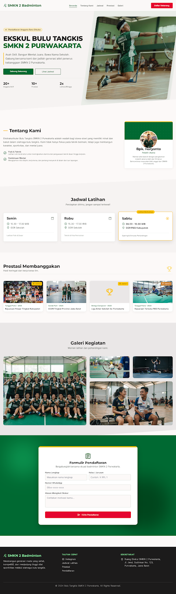

# 🏸 SMKN 2 Badminton Portal & Management System
> **Sistem Informasi & Pendaftaran Ekstrakurikuler Bulu Tangkis SMKN 2 Purwakarta**


<p align="center">
  
</p>

---

## 🌟 Fitur Utama (Features)

1. **Hero & Profil Ekskul Modern**:
   - Tampilan antarmuka berkecepatan tinggi dengan estetika modern, responsive di perangkat mobile dan desktop.
   - Dilengkapi dukungan **Dark Mode** & **Light Mode** dinamis.
2. **Interactive Court Visualizer**:
   - Visualisasi interaktif lapangan bulu tangkis yang responsif dengan animasi taktik dan footwork.
3. **Papan Skor Resmi & Match Center**:
   - Menampilkan hasil kejuaraan dan pertandingan langsung tim sekolah.
4. **Jadwal Latihan & Prestasi Terstruktur**:
   - Daftar jadwal latihan mingguan dengan penanda latihan berikutnya (*next session highlight*).
   - Katalog raihan medali emas, perak, dan perunggu tingkat kabupaten/provinsi beserta profil atlet.
5. **Galeri Momen Kegiatan**:
   - Grid masonry foto-foto dokumentasi latihan, turnamen, dan kebersamaan tim.
6. **Formulir Pendaftaran Atlet Baru (AJAX)**:
   - Validasi instan nomor WhatsApp dan data pendaftaran tanpa reload halaman.
   - Pengecekan status pendaftaran mandiri oleh calon anggota.
7. **Admin Dashboard Pengurus Ekskul (`/admin`)**:
   - Manajemen seluruh data pendaftar calon anggota ekskul.
   - Filter status pendaftar: *Menunggu*, *Diterima*, *Ditolak*.
   - Fitur konfirmasi status pendaftaran dan input catatan pelatih (*coach notes*).

---

## 💻 Panduan Instalasi di Windows (Client Guide)

Untuk pengguna sistem operasi **Windows**, Anda dapat memilih salah satu dari dua cara berikut setelah melakukan clone:

### ⚡ Cara 1: Setup Otomatis Sekali Klik (Rekomendasi Klien)

Proyek ini telah menyediakan file otomatisasi khusus Windows:
1. **Clone repository:**
   ```cmd
   git clone https://github.com/FooledGil/Ekskul-Badminton.git
   cd Ekskul-Badminton
   ```
2. **Klik dua kali (Double-click)** file:
   👉 `setup-windows.bat`
3. Skrip otomatis akan:
   - Membuat file `.env`
   - Mengunduh dependensi PHP (`composer install`)
   - Meng-generate Application Key (`php artisan key:generate`)
   - Menyiapkan database SQLite dan mengisi seluruh data awal (`php artisan migrate:fresh --seed`)
   - Menginstal dependensi frontend & compile CSS/JS (`npm install` & `npm run build`)
4. Setelah selesai, server akan otomatis menyala dan membuka website di peramban Anda!

Untuk menjalankan server di lain waktu, cukup klik dua kali file 👉 `run-windows.bat`.

> 📖 **Panduan lengkap & troubleshooting Windows**: Silakan baca dokumen [PANDUAN_SETUP_WINDOWS.md](./PANDUAN_SETUP_WINDOWS.md).

---

### 🛠️ Cara 2: Setup Manual Langkah demi Langkah (CMD / PowerShell)

Bagi pengembang atau pengguna yang ingin melakukan setup manual:

```cmd
# 1. Masuk ke folder proyek
cd Ekskul-Badminton

# 2. Salin file environment
copy .env.example .env

# 3. Pasang paket PHP Composer
composer install

# 4. Generate App Key
php artisan key:generate

# 5. Siapkan Database SQLite & Jalankan Migrasi + Seeder
type nul > database\database.sqlite
php artisan migrate:fresh --seed

# 6. Buat Symlink Storage
php artisan storage:link

# 7. Pasang paket frontend & build assets
npm install
npm run build

# 8. Jalankan Local Development Server
php artisan serve
```

Aplikasi sekarang aktif di: **`http://127.0.0.1:8000`**

---

## 🐧 Panduan Instalasi di Linux / macOS

```bash
git clone https://github.com/FooledGil/Ekskul-Badminton.git
cd Ekskul-Badminton

cp .env.example .env
composer install
php artisan key:generate
touch database/database.sqlite
php artisan migrate:fresh --seed
php artisan storage:link
npm install
npm run build
php artisan serve
```

---

## 🔗 Endpoint & Rute Navigasi

| Halaman | URL | Keterangan |
| :--- | :--- | :--- |
| **Portal Utama** | `http://127.0.0.1:8000/` | Beranda, Profil, Lapangan, Jadwal, Prestasi, Galeri, Form Daftar |
| **Cek Status** | `http://127.0.0.1:8000/cek-status` | Fitur cek status pendaftaran siswa |
| **Admin Panel** | `http://127.0.0.1:8000/admin` | Dashboard pengurus ekskul untuk verifikasi pendaftar |

---

## 🧰 Tech Stack

- **Backend**: Laravel 13.x, PHP 8.3+
- **Frontend**: Blade Templates, Tailwind CSS v4, Vanilla JavaScript, GSAP Animations
- **Database**: SQLite (Default, Zero-config) atau MySQL
- **Asset Bundler**: Vite 8.x

---

## 📄 Lisensi & Hak Cipta
Dibuat untuk Ekstrakurikuler Bulu Tangkis SMKN 2 Purwakarta.
Hak Cipta © 2026 SMKN 2 Badminton. Seluruh Hak Dilindungi.
